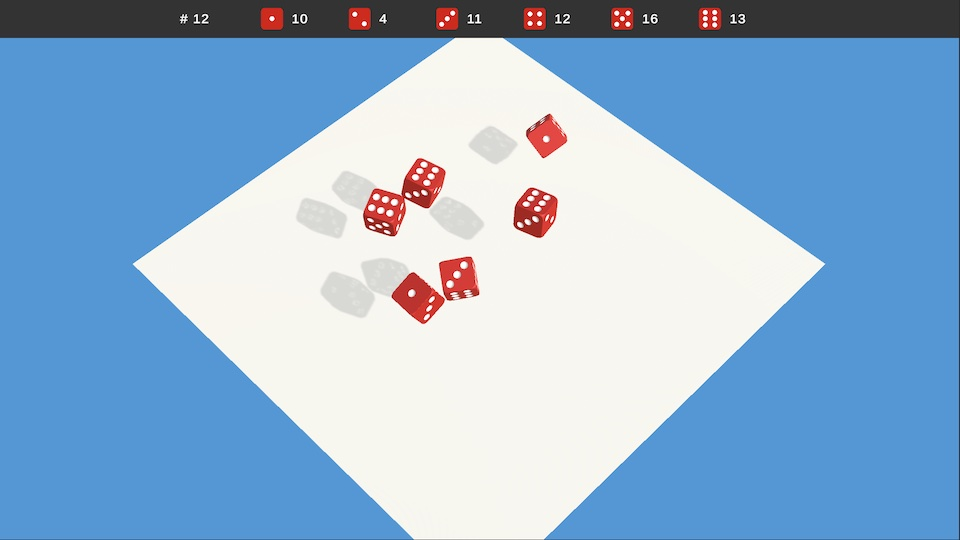

# ai_for_kids

Machine learning and data science demos for kids (6 to 15 years).

## Dices

A unity app to demonstrate randomness with dices.

## LinearClassifier

A three.js app to draw a straight boundary line (the decision boundary) to
separate two sets of 2D points, with a simple SVM classifier.

## Spline

A three.js app to visualize 2D spline interpolation in a 3D space.

